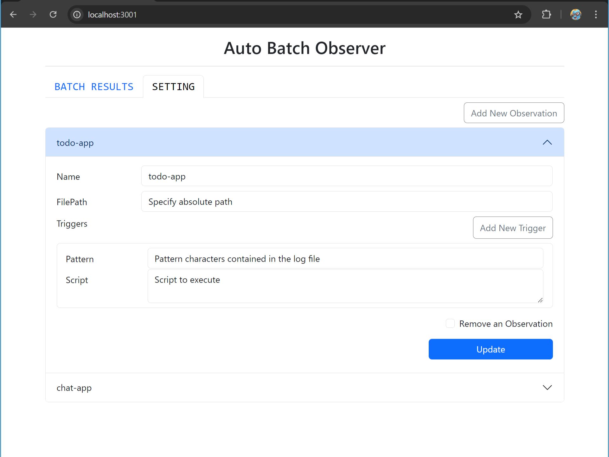

# Auto Batch Observer

The log file is observed in real-time, and if a specific string is found in the differences, the designated batch process will be triggered.


## Getting Start
1. ```sh
   npm install
   ```
2. ```sh
   mkdir data
   echo '{"observations": []}' > .\data\observation.json
   ```
3. ```sh
   npm start
   ```
4. Access http://127.0.0.1:3000/
5. Set log files and triggers to watch
   


## Setting Up Your Local Development Environment

1. ```sh
   npm install
   ```
2. ```sh
   mkdir data
   echo '{"observations": []}' > .\data\observation.json
   ```
3. ```sh
   npm run start:dev
   ```
